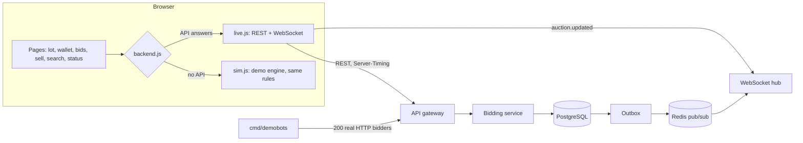

# Auction Engine

[](https://github.com/Ayush1388/auctionEngine/actions/workflows/ci.yml)


**A distributed live auction and bidding engine in Go.** Many people bid on the same item at the same moment, and every bid must be processed correctly, in order, with real money held and released, and shown to everyone watching within milliseconds.

It started as a transactionally consistent monolith and grew, one tested milestone at a time, into a distributed system: PostgreSQL as the source of truth, a transactional outbox feeding Redis, Elasticsearch, WebSockets and Kafka, a bidding service over gRPC, and metrics, traces and alerts. The whole system is deployed and tested end to end on every pull request.

```bash
cp deploy/.env.example deploy/.env   # fill in four secrets: openssl rand -hex 32
make up                              # the full stack, healthy, in one command
make e2e                             # drive it end to end from outside
```

[](docs/media/demo.mp4)

*Forty seconds, real backend, two windows: two people bid in the same instant and exactly one wins; the loser is told the new minimum and how long it waited behind the winner; **Behind the bid** shows every hop of a bid with measured timings; **Stress it** fires 200 bidders at one lot and checks the result from outside.* ([watch the video](docs/media/demo.mp4))

```bash
make infra && cp .env.example .env && make migrate
DEMO_BOTS_ENABLED=true DEMO_SEED=true CHAOS_ENABLED=true make run  # the API on :4000, with the demo cars, the bots and the chaos lab built in
cd frontend && python3 -m http.server 5173                         # http://localhost:5173 (the bots switch is in the badge, bottom left)
```

No backend? The frontend runs alone on a built-in demo engine with the same rules, so a hosted copy works for anyone: publish the `frontend/` folder to any static host. Details: [`docs/FRONTEND.md`](docs/FRONTEND.md).

---

## Contents

- [What makes it interesting](#what-makes-it-interesting)
- [Architecture](#architecture)
- [Tech stack](#tech-stack)
- [How a bid works](#how-a-bid-works)
- [The frontend](#the-frontend)
- [Features in depth](#features-in-depth)
- [API](#api)
- [Running it](#running-it)
- [Testing](#testing)
- [Project layout](#project-layout)
- [Roadmap and documentation](#roadmap-and-documentation)

---

## What makes it interesting

| Problem | How it's solved | Proven by |
|---|---|---|
| 40 people bid on one auction in the same millisecond | One transaction per bid, auction row locked with `SELECT … FOR UPDATE`; optimistic CAS as a switchable alternative | Concurrency tests with 40 simultaneous bidders |
| One user tries to spend the same money on two auctions | Wallet rows locked in a fixed order; balance checked under the lock; `CHECK (available >= 0)` | Double-spend test |
| Two users outbid each other on two auctions at once | Global lock order (auction, then wallets by user ID), so no deadlock cycle can form | Deadlock test |
| A retried request places a second bid | `Idempotency-Key` on bids and deposits, enforced by a unique index | Replay tests, unit and end to end |
| Money appears or disappears | Double-entry ledger: every movement is a journal summing to zero, append-only tables, reconciliation | `wallet.Reconcile`, settlement idempotency test |
| Database commits but the email/event is lost | Transactional outbox: the event is written in the same commit; workers deliver at least once | Rollback tests |
| Kafka reorders bids for one auction | Partitioned by `auction_id`; one consumer per partition; offsets committed after the work | 30 interleaved bids across 4 auctions, plus a deliberately broken worker that fails the test |
| A deploy drops requests | Readiness drain + health-checked load balancer + one-at-a-time rollout | CI rolls out under 10 requests/s and fails on any error |
| Elasticsearch, Redis or the bidding service is down | Circuit breakers, fallbacks (PostgreSQL search, uncached reads), fail-fast 503s | Breaker and fallback tests |

---

## Architecture

```
                         Clients (browser, mobile, CLI)
                                     │ HTTPS · WebSocket
                              ┌──────▼──────┐
                              │    Caddy    │ TLS · load balancing · health checks
                              └──┬───────┬──┘
                       ┌─────────▼─┐   ┌─▼─────────┐
                       │   api-1   │   │   api-2   │  HTTP API · WebSocket hub · rate limits
                       │  outbox + lifecycle workers│  (gateway to the bidding service)
                       └─────┬─────┘   └─────┬─────┘
                             │     gRPC      │
                       ┌─────▼───────────────▼─────┐        ┌──────────────┐
                       │       biddingsvc          │        │  bidworker   │ consumer group
                       │ PlaceBid · ListBids ·     │        │ (Kafka bids, │ one partition
                       │ WatchAuction (stream)     │        │  per auction)│ each, in order
                       └─────────────┬─────────────┘        └──────┬───────┘
                                     │                             │
 ┌───────────────────────────────────▼─────────────────────────────▼──────────────────────┐
 │ PostgreSQL — source of truth: users, auctions, bids, wallets, ledger, outbox_events     │
 └───────────────┬────────────────────────────────────────────────────────────────────────┘
                 │ transactional outbox (same commit as the change)
     ┌───────────┼───────────────┬────────────────────┬─────────────────────┐
     ▼           ▼               ▼                    ▼                     ▼
   SMTP     Elasticsearch      Redis              Redis pub/sub          Kafka
  (email)   (search index)  (cache, trending)  (live fan-out to      (auction-events,
                                                 every API instance)   auction-bids)

 Observability: Prometheus (metrics, alerts) · Grafana (dashboards) · Jaeger (traces)
```

Three rules hold the design together:

1. **PostgreSQL is the only source of truth.** Redis, Elasticsearch, Kafka and the WebSocket feed are all fed from the transactional outbox, and every one of them can be lost and rebuilt.
2. **Services own transaction boundaries.** Repositories accept anything that can run a query (a pool or a transaction) and never begin transactions themselves, so one business operation spanning several tables is one commit ([0005](docs/decisions/0005-transactions-owned-by-services.md)).
3. **Handlers depend on interfaces.** `handlers.Bidder` is satisfied by the in-process bidding service and by the gRPC client, which is why bidding moved into its own service without changing a single handler.

---

## Tech stack

| Concern | Choice |
|---|---|
| Language | Go 1.26, standard library HTTP router, `log/slog` |
| Database | PostgreSQL 18 with `pgx`, hand-written migration runner |
| Cache, rate limits, fan-out | Redis 7 (`go-redis`), Lua scripts for atomic operations |
| Search | Elasticsearch 8 over plain HTTP, PostgreSQL `tsvector` fallback |
| Messaging | Kafka in KRaft mode (`franz-go`) |
| Service-to-service | gRPC + Protocol Buffers |
| Real-time | WebSockets (`coder/websocket`) |
| Auth | Argon2id, JWT access tokens, rotating refresh tokens, RBAC |
| Observability | Prometheus, Grafana, OpenTelemetry → Jaeger, pprof |
| Delivery | Docker (multi-arch), Docker Compose, Caddy, GitHub Actions, GHCR |

Everything is free and open source; no paid service or API is needed.

---

## How a bid works

```
POST /v1/auctions/{id}/bids   Idempotency-Key: 7f3c…   {"amount": 4200}
        │
        ▼
 API (rate limit · JWT · validation) ──gRPC──► bidding service
                                                    │
        BEGIN ──────────────────────────────────────┤
          SELECT … FROM auctions WHERE id = $1 FOR UPDATE      lock the auction
          decide(): open? not the seller? ≥ current + increment?
          SELECT … FROM wallets WHERE user_id IN (…) ORDER BY user_id FOR UPDATE
          check funds under the lock
          INSERT bid · release previous leader · reserve new leader
          post two ledger journals (each sums to zero)
          UPDATE auctions (current bid, version + 1, anti-sniping extension)
          INSERT outbox_events ('bid.placed')
        COMMIT ─────────────────────────────────────┘
        │
        ▼  (after commit, at least once)
 outbox worker → Redis pub/sub → every API's WebSocket hub → everyone watching
               → cache invalidation · search index · trending · Kafka auction-events
```

With `Prefer: respond-async`, the API instead writes a `bid_request` and an outbox event in one commit and returns **202**. The relay publishes it to Kafka keyed by auction, and a bid worker runs the same transaction above, in order.

---

## The frontend

The site is plain HTML, CSS and ES modules (no build step) and exists to make the backend visible.



What it shows, each backed by an endpoint you can read in the [API](#api) table:

- **Live bidding.** A bid in one window appears in the others within milliseconds. Two bidders in the same instant: one wins, the other is told the new minimum and how long it queued behind the winner.
- **Correctness you can see.** Money is held when you lead and released the moment you are outbid; a late bid extends the close; double-clicking Bid places one bid (same `Idempotency-Key`).
- **Behind the bid.** One bid's journey (gateway, row lock, rules, write, commit, outbox, WebSocket) from `Server-Timing` and event timestamps, each number labelled with its source.
- **Stress it.** 200 bidders read one price and bid together; the page checks the history is strictly increasing, counts match, one bidder leads and nothing failed. This check found a real ordering bug in `bids.created_at` (fixed, see [decision 0006](docs/decisions/0006-bid-concurrency.md)).
- **A product around it.** Accounts with token rotation, a wallet with a double-entry statement, my bids, selling, search with fallback, alerts, a status dashboard and an operator console.

## Features in depth

<details>
<summary><b>Concurrent bidding without races, double spending or deadlocks</b></summary>

Every bid is one transaction: lock the auction row (`SELECT … FOR UPDATE`), lock the affected wallets **in user-ID order**, decide, then write the bid, the reservation, two ledger journals, the auction update and a `bid.placed` outbox event together. An optimistic strategy (version compare-and-swap with jittered retries) can be switched on with `BID_LOCKING=optimistic` for comparison.

Tests prove it under load: 40 users bidding at once on one auction, one user trying to spend the same money on two auctions, two users outbidding each other on two auctions at the same instant (the deadlock case), and a bid racing the auction's end. Breaking the lock or the lock order makes those tests fail. Anti-sniping extends the end when a bid lands in the last two minutes. See [0006](docs/decisions/0006-bid-concurrency.md).
</details>

<details>
<summary><b>Double-entry ledger and settlement</b></summary>

Money never changes in place. Every movement (deposit, reserve, release, settle) is a journal whose lines sum to zero, and the ledger tables are append-only, enforced by triggers. `wallet.Reconcile` recomputes all balances from the ledger. Settlement is idempotent, so a redelivered `auction.completed` event can't pay the seller twice. See [0007](docs/decisions/0007-double-entry-ledger.md).
</details>

<details>
<summary><b>Transactional outbox for reliable side effects</b></summary>

A database change and its side effect (an email, a search update, a Kafka message) touch two systems with no shared transaction. Instead, the event is written to `outbox_events` **in the same commit** as the change, and workers deliver it:

```sql
WITH candidates AS (
    SELECT id FROM outbox_events
    WHERE processed_at IS NULL AND failed_at IS NULL
      AND available_at <= now()
      AND (locked_at IS NULL OR locked_at < now() - INTERVAL '5 minutes')
    ORDER BY created_at
    LIMIT $1
    FOR UPDATE SKIP LOCKED           -- many workers, no double processing
)
UPDATE outbox_events e
SET locked_at = now(), attempts = e.attempts + 1
FROM candidates WHERE e.id = candidates.id
RETURNING ...
```

- **`SKIP LOCKED`** lets every instance poll the same table without claiming the same event; a **lease** recovers events from crashed workers.
- **Exponential backoff** (30 s doubling, capped at 1 h) and **dead-lettering** after 8 attempts, with an admin endpoint to retry.
- **LISTEN/NOTIFY** wakes workers about 5 ms after commit instead of waiting for a poll.
- **Secrets don't linger:** the activation token is removed from the payload once the email has been sent.
- Trace context is stored on the row, so a trace continues across the asynchronous hop. See [0001](docs/decisions/0001-transactional-outbox.md).
</details>

<details>
<summary><b>Kafka: ordered, asynchronous bid processing</b></summary>

```
request ─(1 tx: bid_requests + outbox)─► relay ─► Kafka auction-bids (key = auction_id, 12 partitions)
                                                      │ consumer group "bid-workers"
                                                      ▼ one worker per partition, records in order
                                                 bidding.PlaceBid (same rules and locks)
```

- **Partitioning by auction** gives a total order per auction and parallelism across auctions.
- **At-least-once delivery + idempotent processing:** offsets are committed after the work, and redelivered commands reuse the idempotency key.
- **Retries in place** keep order on transient errors; **dead-lettering** after 5 attempts stops one poison message from blocking an auction.
- `cmd/bidworker` scales independently of the API. Every auction event is also streamed to `auction-events`. See [0012](docs/decisions/0012-kafka-bid-pipeline.md).
</details>

<details>
<summary><b>gRPC: bidding as its own service</b></summary>

`cmd/biddingsvc` serves `BiddingService` ([`bidding.proto`](api/proto/bidding/v1/bidding.proto)): `PlaceBid`, `ListBids` and the server-streaming `WatchAuction`. With `BIDDING_GRPC_ADDR` set, the API becomes a gateway that calls it.

- Domain errors cross the network as gRPC codes with `ErrorInfo`/`BadRequest` details and come back as the same Go errors; an unreachable service becomes a **503**.
- **Deadlines propagate** into PostgreSQL: when the caller gives up, the query is cancelled.
- **Retries are safe** because every call carries an idempotency key. Interceptors add service-to-service auth, request-ID and trace propagation, metrics and logging. See [0013](docs/decisions/0013-bidding-service-over-grpc.md).
</details>

<details>
<summary><b>Live updates over WebSockets</b></summary>

Connect to `GET /v1/ws`, send `{"action":"subscribe","auction_id":"…"}`, and every bid, extension or status change arrives as a full snapshot. Try [`docs/examples/live-auction.html`](docs/examples/live-auction.html).

- The outbox hands an event to **one** instance, but viewers are connected to **all** of them, so snapshots fan out through **Redis pub/sub** to every instance's hub.
- Each message carries the auction `version`, so clients drop out-of-order updates.
- **Backpressure:** a bounded buffer and one writer goroutine per connection; a client too slow to keep up is disconnected instead of stalling the room.
- **Heartbeats** detect dead connections; an origin allow-list blocks cross-site WebSocket hijacking; a connection cap sheds load. See [0011](docs/decisions/0011-websocket-fanout.md).
</details>

<details>
<summary><b>Search: Elasticsearch as a read model</b></summary>

`GET /v1/auctions/search?q=vintage camra` tolerates typos, ranks title matches first and highlights matches. `GET /v1/auctions/suggest?q=iph` autocompletes from edge n-grams.

- The index is fed only by **outbox events**; **external versioning** means a late or duplicate event can't roll a document back.
- Search returns IDs, and auctions are loaded from PostgreSQL in **one query**: no N+1, exact prices.
- If Elasticsearch is down, **PostgreSQL full-text search** (generated `tsvector` + GIN index) answers, behind a circuit breaker.
- `admin reindex` rebuilds the index with **zero downtime** by swapping an alias. See [0010](docs/decisions/0010-search-as-a-read-model.md).
</details>

<details>
<summary><b>Redis: cache, trending, shared rate limits</b></summary>

Redis only holds data that is cheap to lose ([0009](docs/decisions/0009-redis-as-a-disposable-accelerator.md)):

- **Cache-aside** auction reads with a 30 s TTL, invalidated by outbox events; **singleflight** turns 100 simultaneous misses into one query.
- **Trending** from hourly sorted-set buckets, fed idempotently by a Lua script.
- **Token buckets as an atomic Lua script**, so every API instance shares one limit per client.

If Redis is down, reads go to PostgreSQL, trending is computed from PostgreSQL and rate limits fail open.
</details>

<details>
<summary><b>Auctions: state machine, race-free changes, keyset pagination</b></summary>

```
NOT_ACTIVE ──(starts_at)──► ACTIVE ──(ends_at)──► COMPLETED
    │
    └──(owner cancels)──► CANCELLED
```

- The allowed moves live in one map; SQL derives its `WHERE status = ANY(...)` from it, so code and queries can't drift. A test checks all 16 state pairs.
- Cancelling is one guarded `UPDATE … WHERE status = ANY($2) AND owner_id = $3 AND starts_at > $4`, so it can't race the worker that activates the auction (25-round race test).
- A **lifecycle worker** on every instance claims due auctions with `SKIP LOCKED`; completion and its `auction.completed` event commit together.
- **Keyset pagination** on `(created_at, id)`: page 500 costs the same as page 1, and new auctions never cause duplicates. Every filter has a matching composite index, verified with `EXPLAIN`.
</details>

<details>
<summary><b>Auth, sessions and abuse protection</b></summary>

- **Argon2id** password hashing (parameters stored per hash, upgraded on login)
- **Account activation** with hashed, expiring, single-use tokens, sent through the outbox
- **Short-lived JWT access tokens + rotating refresh tokens** with reuse detection and logout ([0008](docs/decisions/0008-access-and-refresh-tokens.md))
- **RBAC**: `user` and `admin` roles; admin-only operator endpoints
- **Token-bucket rate limiting** per IP, per user and per login email; `X-Forwarded-For` trusted only from configured proxies
- **No account enumeration:** the same answers and timing whether an email exists or not
- Request IDs, structured access logs, panic recovery, CORS allow-list and security headers on every response
- **OpenAPI 3.1** contract at `/v1/openapi.json`, kept in sync with the router by a test
</details>

<details>
<summary><b>Observability, resilience and performance</b></summary>

- **Prometheus metrics** on an internal admin port: RED metrics per route and gRPC method, bid outcomes and latency, outbox backlog and dead letters, Kafka consumer lag, DB pool saturation, cache hit ratio, WebSocket connections. Labels are bounded (route patterns, never raw paths). Alert rules and a Grafana dashboard ship in [`deploy/`](deploy/).
- **Distributed tracing** with OpenTelemetry: one trace follows a bid through HTTP, gRPC, SQL, the outbox row and Kafka to the bid worker. `trace_id` is in every log line.
- **Probes:** `/livez` and `/readyz`. On SIGTERM an instance **drains** (readiness 503, keeps serving for `DRAIN_DELAY`) before closing.
- **Circuit breakers** in front of Elasticsearch, the bidding service and SMTP; **load shedding** with an in-flight limit; **pprof** for live profiling.
- **Measured, not guessed:** a load generator, a k6 script with SLO thresholds and benchmarks. Load testing found a 4-connection DB pool and a throttled outbox; fixing them made reads **2.8×** faster. See [`docs/PERFORMANCE.md`](docs/PERFORMANCE.md).
</details>

<details>
<summary><b>Production delivery</b></summary>

- **One multi-arch image** (amd64 + arm64) with every binary, non-root, published to GitHub Container Registry from `main`
- **Full stack with Compose** ([`deploy/compose.yml`](deploy/compose.yml)): Caddy with automatic HTTPS and health-checked load balancing, two API instances, the bidding service, bid workers, PostgreSQL, Redis, Elasticsearch, Kafka, Prometheus, Grafana, Jaeger and nightly backups
- **Zero-downtime rollouts** ([`deploy/rollout.sh`](deploy/rollout.sh)), backup and restore scripts
- **Graceful shutdown:** HTTP drains first, then workers finish their current event, within a deadline
- Details in [`docs/DEPLOYMENT.md`](docs/DEPLOYMENT.md)
</details>

---

## API

| Method | Route | Auth | Description |
|---|---|---|---|
| `POST` | `/v1/users/register` | | Create an account and queue the activation email |
| `GET` | `/v1/users/activate?token=…` | | Activate an account |
| `POST` | `/v1/users/resend-activation` | | New activation email (always `204`, so it can't probe for accounts) |
| `POST` | `/v1/users/login` | | Access token + refresh token |
| `POST` | `/v1/auth/refresh` | | Rotate the refresh token, get a new access token |
| `POST` | `/v1/auth/logout` | | Revoke the session |
| `GET` | `/v1/users/me` | JWT | Current user |
| `POST` | `/v1/auctions` | JWT | List an item for auction |
| `GET` | `/v1/auctions` | optional | Newest first: `?status=ACTIVE&owner=me&limit=20&cursor=…` |
| `GET` | `/v1/auctions/trending` | | Most bids in the last hour |
| `GET` | `/v1/auctions/search` | | Full-text search: `?q=…&status=&limit=&cursor=` |
| `GET` | `/v1/auctions/suggest` | | Type-ahead: `?q=…` |
| `GET` | `/v1/auctions/{id}` | | One auction with its item (cached) |
| `POST` | `/v1/auctions/{id}/cancel` | JWT (owner) | Cancel before it starts |
| `POST` | `/v1/auctions/{id}/bids` | JWT | Place a bid (`Idempotency-Key`; `Prefer: respond-async` for 202) |
| `GET` | `/v1/auctions/{id}/bids` | | Bid history, newest first |
| `GET` | `/v1/bid-requests/{id}` | JWT (owner) | Outcome of an async bid |
| `GET` | `/v1/ws` | | WebSocket: live auction updates |
| `GET` | `/v1/wallet` | JWT | Available and reserved balance |
| `POST` | `/v1/wallet/deposits` | JWT | Add test funds (`Idempotency-Key` required) |
| `GET` | `/v1/wallet/ledger` | JWT | Every money movement, newest first |
| `GET` | `/v1/admin/reconcile` | admin | Check the books balance |
| `GET` | `/v1/admin/outbox/failed` | admin | Dead-lettered events |
| `POST` | `/v1/admin/outbox/{id}/retry` | admin | Requeue a dead-lettered event |
| `GET` | `/livez`, `/readyz` | | Liveness and readiness probes |
| `GET` | `/v1/openapi.json` | | OpenAPI 3.1 description of this API |

Errors are always JSON, with a `fields` map for validation errors:

```json
{"error": "invalid input", "fields": {"ends_at": "must be after starts_at", "item.name": "is required"}}
```

Prices are integers in the smallest currency unit (paise/cents); money is never a float.

---

## Running it

### The full system

```bash
cp deploy/.env.example deploy/.env    # fill in the four secrets (openssl rand -hex 32)
make up                               # build and start everything, wait until healthy
make e2e                              # end-to-end test against it
make down                             # stop
```

| URL | What |
|---|---|
| <http://localhost> | the API, through Caddy |
| <http://localhost:3000> | Grafana (user `admin`, password from `deploy/.env`) |
| <http://localhost:16686> | Jaeger traces |
| <http://localhost:8025> | Mailpit: every email the system sends |
| <http://localhost:9090> | Prometheus |

HTTPS on a real domain, rolling deploys, backups and scaling: [`docs/DEPLOYMENT.md`](docs/DEPLOYMENT.md).

### For development

```bash
make infra                 # PostgreSQL, Redis, Elasticsearch, Kafka, Mailpit
cp .env.example .env       # sensible local defaults
make migrate               # apply migrations
make run                   # start the API on :4000
```

Optional pieces turn on when their setting is present: `REDIS_URL`, `ELASTICSEARCH_URL`, `KAFKA_BROKERS` (async bids), `BIDDING_GRPC_ADDR` (call `cmd/biddingsvc` over gRPC), `ADMIN_ADDR` (metrics and pprof), `OTEL_EXPORTER_OTLP_ENDPOINT` (traces). Without them the API runs as a plain monolith on PostgreSQL. Every setting is documented in [`internal/config/config.go`](internal/config/config.go).

`make help` lists every task; `go run ./cmd/migrate -down 1` rolls back the latest migration.

---

## Testing

| Layer | What | Run |
|---|---|---|
| Unit | pure logic: bid decisions, state machine, validation, rate limiter, circuit breaker | `go test ./...` |
| Integration | real PostgreSQL, Redis, Elasticsearch, Kafka; each test gets its own freshly migrated schema | set `TEST_DATABASE_URL`, `TEST_REDIS_URL`, `TEST_ELASTICSEARCH_URL`, `TEST_KAFKA_BROKERS` |
| Concurrency | 40 simultaneous bidders, double spend, deadlock, cancel-vs-activate races, 4 competing workers | part of the integration suite, under `-race` |
| HTTP and gRPC | status codes, error shapes, deadlines, error details | part of the suite |
| End to end | the deployed stack driven from outside, through every component | `make up && make e2e` |
| Deploy | rolling deploy under constant traffic must drop zero requests | CI |
| Frontend | the demo engine must follow the backend's rules, including 500 random bids that keep every ledger invariant | `node --test frontend/tests/sim-engine.test.mjs` |

Integration tests skip themselves when their service isn't configured, so `go test ./...` always works. CI runs everything on every pull request, against real services.

---

## Project layout

```
cmd/
  api/            HTTP API: wiring, workers, graceful shutdown (the composition root)
  biddingsvc/     the bidding service (gRPC)
  bidworker/      Kafka bid consumers
  migrate/        migration CLI (up, or -down N)
  admin/          operator CLI (promote, demote, reindex)
  loadgen/        load generator
  demobots/       demo data and the Stress it bots for the frontend
internal/
  auction/        state machine, service, repository, lifecycle worker, keyset pagination
  bidding/        placing bids (two locking strategies), history, settlement
  wallet/         wallets, double-entry ledger, reconciliation
  user/ session/  accounts, Argon2id, activation, JWT; refresh tokens with rotation
  auth/           JWT middleware (required, optional, RequireRole)
  outbox/         transactional outbox: repository, worker, router
  realtime/       WebSocket hub, rooms, heartbeats, backpressure, Redis fan-out
  search/         Elasticsearch + PostgreSQL backends, indexer, reindex
  auctioncache/   cache-aside reads, singleflight, invalidation
  trending/       hourly sorted-set ranking
  kafkax/ bidqueue/  topics, producer, outbox → Kafka relay; async bids and workers
  grpcsvc/ gen/   gRPC server, client, interceptors, error mapping; generated code
  ratelimit/ middleware/  token buckets; request IDs, logging, recover, CORS, headers
  metrics/ telemetry/ health/ breaker/  Prometheus, OpenTelemetry, probes, circuit breaker
  database/ migration/ httpx/ validation/ config/ email/  foundations
api/              OpenAPI document and protobuf contracts
migrations/       versioned up/down SQL
deploy/           production stack: compose.yml, Caddyfile, Prometheus, Grafana, scripts
e2e/              end-to-end test against the deployed stack
loadtest/         k6 script
frontend/         the web app (plain HTML, CSS and ES modules); see docs/FRONTEND.md
docs/             decisions, deployment, performance, workflow, frontend
```

---

## Roadmap and documentation

| Milestone | Scope |
|---|---|
| v0.1 Users and auth ✅ | registration, Argon2id, activation via outbox, JWT, graceful shutdown |
| v0.2 Auctions ✅ | state machine, race-free cancel, keyset pagination, lifecycle worker |
| v0.3 Bidding ✅ | concurrent bids, reservations, double-entry ledger, settlement, idempotency, anti-sniping |
| v0.4 Security ✅ | rate limiting, refresh tokens, RBAC, CORS, request IDs, OpenAPI |
| v0.5 Redis ✅ | cache-aside, stampede protection, trending, shared rate limits |
| v0.6 Search ✅ | Elasticsearch read model, typo tolerance, autocomplete, fallback, zero-downtime reindex |
| v0.7 Real-time ✅ | WebSocket rooms, heartbeats, backpressure, multi-instance fan-out |
| v0.8 Kafka ✅ | outbox relay, partitioning by auction, consumer groups, idempotent consumers, DLQ |
| v0.9 gRPC ✅ | bidding service, streaming, deadlines, interceptors, error details, safe retries |
| v1.0 Production ✅ | metrics, tracing, probes, circuit breakers, load tests, deployment, e2e in CI |
| v1.1 Frontend ✅ | live bidding UI, Behind the bid, Stress it, wallet and ledger, selling, search, alerts, status and operator pages, a demo engine that needs no server |

- **Why it's built this way:** [`docs/decisions/`](docs/decisions/) (15 decision records)
- **The frontend and its demo engine:** [`docs/FRONTEND.md`](docs/FRONTEND.md)
- **Deploying and operating it:** [`docs/DEPLOYMENT.md`](docs/DEPLOYMENT.md)
- **Load test results and the fixes they led to:** [`docs/PERFORMANCE.md`](docs/PERFORMANCE.md)
- **How work is done (issues, branches, PRs):** [`docs/WORKFLOW.md`](docs/WORKFLOW.md)
