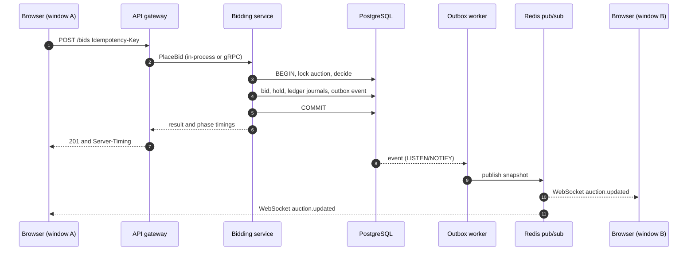

# The frontend

A vintage-car auction site (Marque) built on the engine. It is plain HTML, CSS and ES modules: no build step, no framework. Its job is to make the backend visible: every page reads from the real API, updates live over the WebSocket, and can show what happened behind a bid.

```bash
cd frontend && python3 -m http.server 5173      # http://localhost:5173
```

## Three ways to run it

| Mode | What it needs | What you get |
|---|---|---|
| **Real backend** | `make infra && make run` (API on :4000), then `go run ./cmd/demobots seed` | Every number is measured on PostgreSQL, the outbox and the WebSocket. The status pill says "Live backend". |
| **Plus Stress it** | `RATE_LIMITS=off` on the API, then `go run ./cmd/demobots serve` | The Stress it button fires hundreds of real HTTP bidders at one lot. |
| **No backend** | nothing | The site runs on a built-in **demo engine** that follows the same rules, in the browser. The pill says "Demo engine" and every timing is labelled simulated. |

The page tries the real API first (`http://localhost:4000`, 1.5 s) and falls back to the demo engine. Force a choice with `?engine=sim`, `?engine=live` or `?engine=auto`; set other endpoints with `?api=`, `?bots=` and `?jaeger=`. The choice is remembered.

Demo accounts (real backend after `demobots seed`, and the demo engine): `demo@marque.test`, `collector@marque.test`, `admin@marque.test`, password `marque-demo-password`, each with $2,000,000. Sign in as two different people in two windows to see two bidders on one lot.

## What each page shows

| Page | Backed by | What it demonstrates |
|---|---|---|
| Home, event | `GET /v1/auctions`, WebSocket | Live prices and clocks on every card; the Bid button places a real bid at the minimum |
| **Lot** | bids, wallet, WebSocket | A bid in one window appears in the others in milliseconds. Two people bidding in the same instant: exactly one wins, the other is told the new minimum and how long it waited behind the winner. Held money is shown and released the moment you are outbid. A bid in the last two minutes extends the close. Double-clicking Bid places one bid (same `Idempotency-Key`). |
| **Behind the bid** | `Server-Timing`, WebSocket timestamps | The journey of one bid: network and gateway, the row lock, the rules, the write, the commit, the outbox to fan-out, the click to the live update. Each number says where it comes from. |
| **Stress it** | `cmd/demobots` or the demo engine | 200 bidders read the same price and bid at once for several rounds. The page then checks, from the outside, that the history is strictly increasing, the counts match, one bidder leads and nothing failed. |
| Sign in, create, activate | `/v1/users/*`, `/v1/auth/*` | Argon2id accounts, activation tokens, JWT access tokens and rotating refresh tokens (per tab, so two windows can be two people) |
| Wallet | `/v1/wallet`, `/deposits`, `/ledger` | Available and held money, idempotent deposits, and the double-entry statement |
| My bids | the ledger, bid history | Leading, outbid, won, lost, saved; worked out from the ledger, which records every hold, release and sale |
| Sell a car | `POST /v1/auctions`, `/cancel` | A listing form that maps the server's field errors, a live preview, my listings with cancel |
| Search, trending | `/search`, `/trending` | Typo-tolerant search that says which backend answered (Elasticsearch or the PostgreSQL fallback) |
| Alerts | WebSocket | "You were outbid", "you won", "closed" |
| Status | `/livez`, `/readyz`, `/v1/admin/metrics` | Probes for everyone; bids per second, p95 latency, queue depth and breakers for operators |
| Operator console | `/v1/admin/reconcile`, `/outbox/failed` | "Do the books balance?" and retrying dead-lettered events |

## How a bid shows up on screen



Kafka is not in this picture because it is only on the optional asynchronous path (`Prefer: respond-async`). A synchronous bid skips it, and the panel says so instead of drawing a hop that did not happen.

## What the backend gained for this

All additive; existing clients are unaffected.

| Change | Why |
|---|---|
| `Server-Timing` on `POST /v1/auctions/{id}/bids`: `lock`, `decide`, `write`, `commit`, `bidding` (also on refused bids) | The panel's timings are measured by the server. A refused bid's `lock` is how long it waited behind the winner. |
| `X-Trace-ID` response header when tracing is on | Link a bid to its trace |
| WebSocket `auction.updated` gains `bid` (id, bidder, previous bidder, amount) and `timing` (placed and sent, both from the API clock) | A client can match its own bid, know it was outbid, and see the outbox delay without clock sync |
| `GET /v1/admin/metrics` | The status page reads the same series Prometheus scrapes, behind the admin role |
| CORS exposes the headers above | A browser can only read exposed headers |
| `bids.created_at` is `clock_timestamp()` | A bug the Stress it read-back found: see [decision 0006](decisions/0006-bid-concurrency.md) |

`cmd/demobots` is dev tooling in the style of `cmd/loadgen`: `seed` writes the catalogue and demo accounts through the real services, so every seeded bid has a real hold and ledger entry; `serve` runs the stress bots.

## How it is organised

```
frontend/
  *.html, *.js, *.css      the original site: home, event, lot pages
  app/
    backend.js             picks the real API or the demo engine
    live.js  api.js  feed.js  session.js   the real API: REST, refresh rotation, WebSocket
    sim-engine.js          the demo engine's rules (pure, tested in Node)
    sim.js                 the demo engine as a backend: host window, shared across windows
    bidding.js             one lot: loading, live updates, placing a bid, explaining the outcome
    trace.js  chart.js     Behind the bid, charts
    shell.js  cards.js     header, wallet chip, alerts, engine badge; live cards
    catalog.json           the 12 cars: the single source for the site, the demo engine and the Go seeder
    pages/*.js  *.css      one script per page
  tests/                   node --test
```

Both backends implement one interface (`app/live.js` and `app/sim.js`), so a page never knows which it is talking to.

**The demo engine.** `sim-engine.js` is an in-memory auction house with the backend's rules: minimum bid, one leader, held and released money, double-entry journals, anti-sniping, idempotency, settlement, refresh-token rotation and reuse detection. `sim.js` adds what a server has: all windows on a device share one engine (the window holding a Web Lock hosts it, the others talk to it over a BroadcastChannel, and another window takes over if the host closes), simulated network and outbox delay, rival bidders, and the stress runner. `tests/sim-engine.test.mjs` checks the rules, including 500 random bids that must keep every ledger invariant.

**Listings and photos.** The API's item has a name, type and description, so a car's year, make, photo and specs travel in a metadata block at the end of the description (`[[marque:{...}]]`, see `app/model.js`). An uploaded photo stays in the uploader's browser; everyone else sees the house photo chosen with it.

## Hosting a demo

Publish the `frontend/` folder to any static host (Netlify, Vercel, GitHub Pages). With no API reachable it runs on the demo engine, so the link works for anyone, with no backend. To point a hosted copy at a deployed API, add its origin to `CORS_ALLOWED_ORIGINS` and open the page once with `?api=https://your-api.example`.

## Recording the demo

`docs/media/demo.mp4` is two real windows (Demo bidder and Collector) against the real backend: a simultaneous bid, Behind the bid, then Stress it. To make your own, run the backend and bots as above, then record two browser windows side by side; the sequence is: both click Place bid in the same instant, the loser rebids, open Behind the bid, run Stress it.

## Limits worth knowing

- The API has no proxy (maximum) bidding, so the page does not offer it.
- Type-ahead (`/suggest`) is Elasticsearch-only on the API. Without Elasticsearch the page falls back to matching the open lots' titles in the browser.
- Search without Elasticsearch has no typo tolerance; the page says which backend answered.
- Activation links in emails point at the API (`/v1/users/activate?token=`). The Activate tab takes the token from that link.
- Tokens live in `sessionStorage`: they are readable by script on the page. That is a known trade-off for a token-in-header API; the API sets a strict CSP on its own responses.
- `Server-Timing` splits a bid into lock, rules, write and commit when bidding runs in the API process. With the bidding service split out over gRPC the gateway reports the whole call as one step.

## Tests

```bash
node --test frontend/tests/sim-engine.test.mjs        # the demo engine's rules
go test ./internal/bidding ./internal/handlers ./internal/realtime ./internal/metrics ./internal/middleware
```
